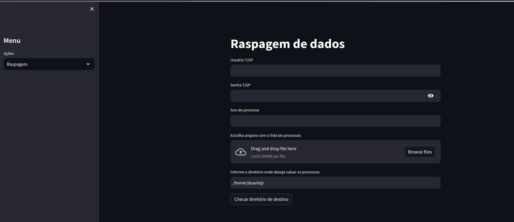
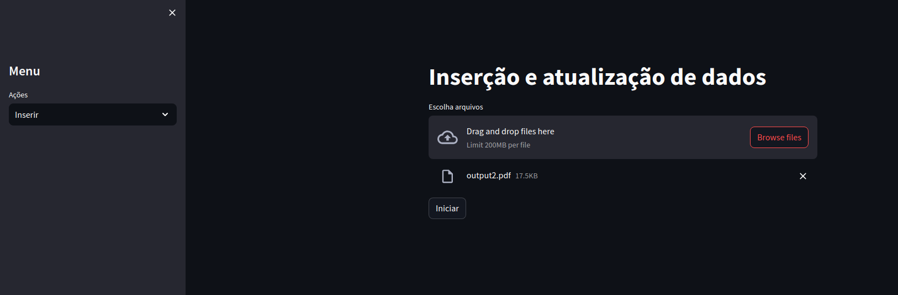
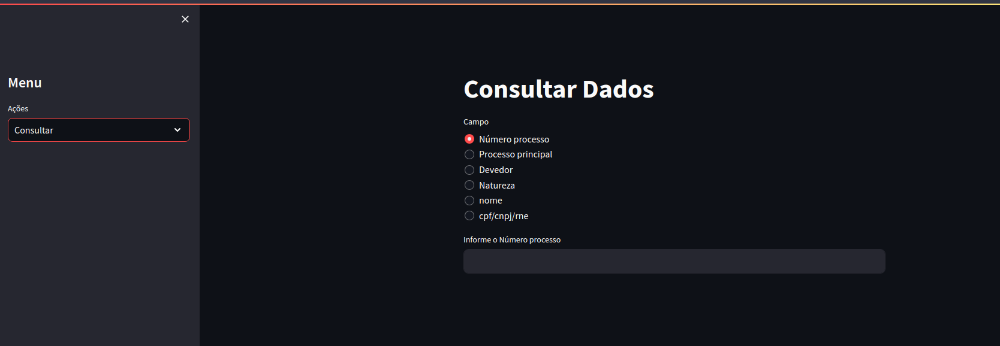
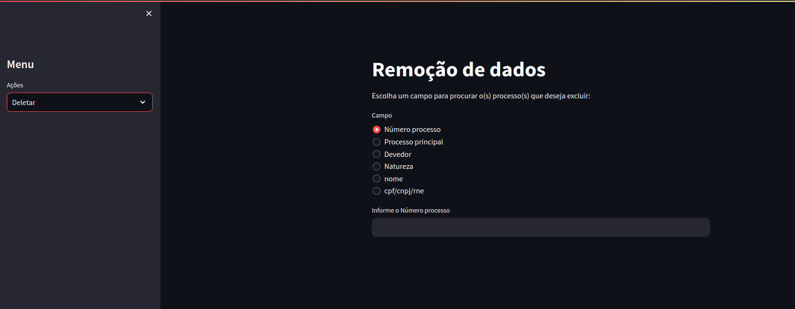

# Raspagem de processos do TJSP

## Descrição
Este projeto foi criado para realizar a raspagem de processos no portal do TJSP a partir de um arquivo PDF com a listagem de processos a ser consultada. Os processos são baixados em um diretório definido pelo usuário e após podem ser exportados para um banco de dados MongoDB.

Existem 4 telas nas quais o usuário pode interagir:

1. Raspagem: Realiza a raspagem dos processos no TJSP.
2. Inserir: Insere os dados dos processos em um banco de dados MongoDB.
3. Consultar: Permite a consulta de processos salvos no MongoDB.
4. Deletar: Permite a remoção de processos do banco de dados do MongoDB.

## Requisitos

A ferramenta foi desenvolvida utilizando:
* Python versão 3.10
* Pymongo versão 4.5.0
* Streamlit versão 1.27.0
* Selenium versão 4.13.0
* re versão 2.2.1
* Pdfminer versão 20221105
* Firefox webdriver

A seguir descreve-se, um pouco, do uso da ferramenta.

## Tela 1 - Raspagem: Raspagem de dados

Na primeira tela é realizada a raspagem dos dados.

O usuário deve informar suas credenciais de acesso ao portal TJSP (login e senha)

Caso deseje realizar a raspagem para um ano específico o usuário deve preencher o campo [Ano do processo] com o ano desejado. Caso não seja informado nenhum ano o programa irá realizar o download de todos os processos listados no arquivo PDF informado no passo seguinte.

Na próxima etapa [Escolha um arquivo com a lista de processos] o usuário deve inserir um arquivo PDF com a listagem de processos que deseja consultar.

Em seguida o usuário insere o caminho do diretório de destino onde deseja salvar os arquivos. OBS: Usuários Windows devem inserir o caminho de destino utilizando / aon invés de \ como separador de diretório.

Clicando no botão [Checar diretório de destino] o sistema irá verificar se o diretório informado no passo anterior é válido.

Finalizando todas as estapas irá aparecer o botao [Iniciar raspagem] e o sistema irá iniciar a pesquisa de download dos processos acessíveis no portal do TJSP. O sistema não matém arquivos duplicados. Portanto, caso já existam arquivos no diretório de destino, do mesmo processo que será baixado, o sistema irá susbtituir mantendo sempre a versão mais recente do processo.

## Tela 2 - Inserir: Inserção e atualização de dados

A segunda tela é utilizada para inserir os dados no banco de dados MongoDB. O usuário deve informar a listagem de arquivos PDF dos processos (os arquivos baixados na etapa anterior). Após carregar a listagem o usuário clica no botão [Iniciar] e os dados dos processos serão extraídos dos PDFs e inseridos no banco de dados cadastrado nas configurações internas do sistema.

## Tela 3 - Consultar: Consultar dados do banco de dados

Nesta tela o usuário pode consultar os processos que estão no banco de dados MongoDB.

A consulta pode ser feita através de:
* Número do processo : Número processo
* Número do processo principal : Processo principal
* Orgão devedor : Devedor
* Natureza do processo : Natureza
* Nome do credor : nome
* CPF/CNPJ/RNE do credor: cpf/cnpj/rne

## Tela 4 - Deletar: Deletar dados do banco de dados

Nesta tela o usuário pode consultar e deletar processos que estão no banco de dados MongoDB.

A consulta pode ser feita através de:
* Número do processo : Número processo
* Número do processo principal : Processo principal
* Orgão devedor : Devedor
* Natureza do processo : Natureza
* Nome do credor : nome
* CPF/CNPJ/RNE do credor: cpf/cnpj/rne

Após pesquisa o sistema irá mostrar a listagem de processos encontrados segundo o critério de pesquisa. É exibido um botão para o usuário confirmar a remoção dos processos encontrados.
